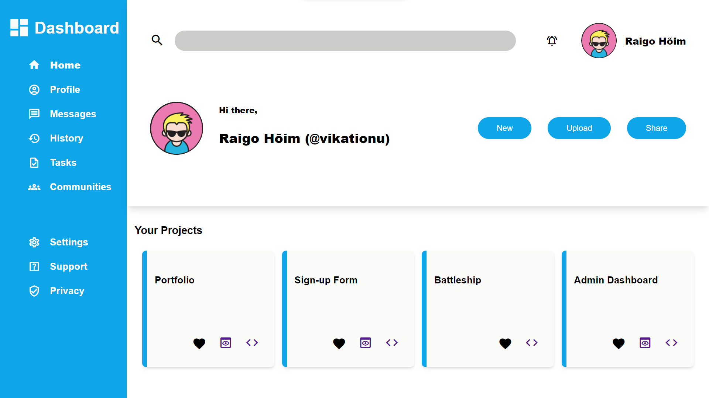

# Admin Dashboard Webpage



This repository contains the HTML and CSS code for a static webpage called "Admin Dashboard." It is a user interface template that can be used as a starting point for creating an admin dashboard for web applications.

## Preview

You can preview the Admin Dashboard webpage by visiting the live demo [here](https://hdashboard.netlify.app/).

## Features

- **Header Section**: Includes a search bar and user account information.

- **Sidebar Navigation**: A sidebar with navigation links for different sections.

- **Projects Section**: A section showcasing example projects with cards.

## Usage

You can use this template as a foundation for building your own admin dashboard or customize it for your specific web development project.

1. Clone this repository to your local machine:

   ```bash
   1. git clone https://github.com/raigoh/Admin-Dashboard.git
   
2. Open the index.html file in your web browser to view the webpage.
3. Modify the HTML and CSS code to suit your project's requirements.

## Credits

- Icons: Material Icons

## License

This project is open-source and available under the MIT License.
